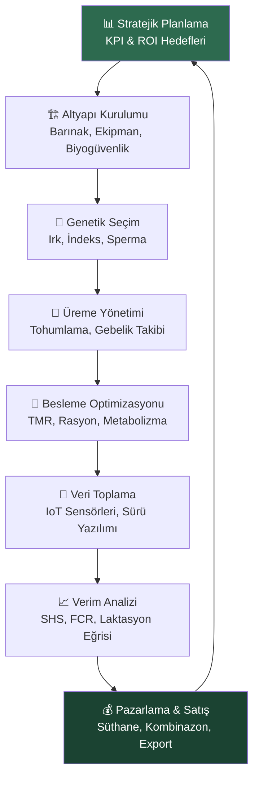
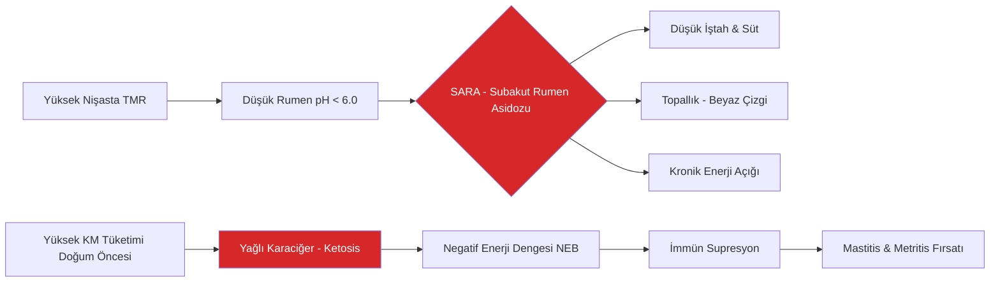
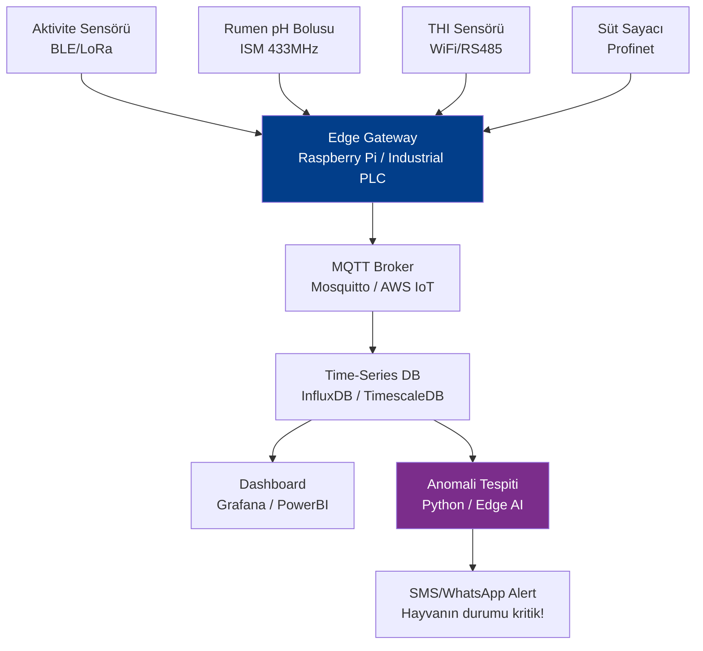

# 🐄 Beyaz Yaka Hayvancılık 101 | White-Collar Livestock Masterclass

[](https://opensource.org/licenses/MIT)
[]()
[]()
[]()
[]()

> **TR:** Kurumsal dünyadan tarımsal üretime geçiş yapan profesyoneller için; veri odaklı, teknik ve sürdürülebilir hayvancılığın ansiklopedik kılavuzu. Genetikten finansmana, beslenmeden IoT'ye kadar her şey bu repoda.
>
> **EN:** The encyclopedic guide to data-driven, technical, and sustainable livestock management for professionals transitioning from the corporate world. From genetics to finance, nutrition to IoT — everything is in this repository.

---

## 📑 İçindekiler | Table of Contents

| # | Bölüm / Section | Açıklama / Description |
|---|---|---|
| 1 | [📌 Misyon & Mimari](#-misyon-ve-mimari) | Stratejik vizyon ve iş modeli |
| 2 | [🧬 Genetik & Islah](#-genetik-ve-islah) | Irk seçimi, crossing, genomik |
| 3 | [🌾 Besleme & TMR](#-besleme-ve-tmr) | Rasyon, silaj, metabolizma |
| 4 | [🏗️ Altyapı & Barınak](#️-altyapı-ve-barınak) | Ahır tasarımı, klimatizasyon |
| 5 | [🛡️ Biyogüvenlik & Sağlık](#️-biyogüvenlik-ve-sağlık) | Aşılama, karantina, zoonoz |
| 6 | [📡 Akıllı Tarım & IoT](#-akıllı-tarım-ve-iot) | Sensörler, Edge AI, LoRaWAN |
| 7 | [📉 Finans & ROI](#-finans-ve-roi) | Maliyet, FCR, iş planı |
| 8 | [⚙️ Araçlar & Scriptler](#️-araçlar-ve-scriptler) | Python araçları |
| 9 | [📚 Bilgi Tabanı](#-bilgi-tabanı) | Dokümanlar ve kılavuzlar |
| 10 | [🤝 Katkı & Lisans](#-katkı-ve-lisans) | Topluluk ve açık kaynak |

---

## 📌 Misyon ve Mimari

### Neden "Beyaz Yaka Hayvancılık"?

Türkiye'de hayvancılık sektörü, son 20 yılda dramatik bir dönüşüm yaşadı. Ancak sektöre giren beyaz yakalı profesyoneller, teknik bilgiye sistematik biçimde ulaşmakta ciddi güçlük çekiyor. Bu repo, bu boşluğu **kurumsal metodoloji** ile dolduruyor.

> Hayvancılık artık bir "dede usulü" değil; **Genetik Optimizasyon × Veri Analitiği × Finansal Modelleme** üçgeninde yönetilen bir işletmedir.

### İşletme Yaşam Döngüsü | Operational Lifecycle



### Temel Performans Göstergeleri | Core KPIs

| KPI | Tanım | İdeal Hedef |
|---|---|---|
| **Somatik Hücre Sayısı (SHS)** | Süt kalitesi ve meme sağlığı | < 200,000 hücre/mL |
| **Yem Dönüşüm Oranı (FCR)** | Kg yem / Kg canlı ağırlık artışı | 5.5-6.5 (Besi) |
| **Buzağı Ölüm Oranı** | Doğumdan 60 güne ölüm | < 5% |
| **Gebe Kalma Oranı** | Tohumlanan hayvan / Gebe kalan | > 55% |
| **Süt/Yem Paritesi** | 1L süt fiyatı / 1kg kesif yem | > 1.5 |
| **Kalitatif Döküm Oranı** | Zorunlu sürü çıkışı yüzdesi | < 25% |

---

## 🧬 Genetik ve Islah

### Irk Seçim Matrisi | Breed Selection Matrix

| Irk | Tip | Süt (L/Yıl) | ET (kg/Gün) | Adaptasyon | Hastalık Direnci |
|---|---|---|---|---|---|
| **Holstein** | Süt | 8,000-12,000 | Düşük | İyi Bakım Gerektirir | Orta |
| **Jersey** | Süt (Yağ) | 5,000-7,000 | Düşük | Yüksek | Yüksek |
| **Montbeliard** | Çift Yönlü | 6,000-8,000 | Orta | Yüksek | Yüksek |
| **Angus** | Et | - | 1.4-1.7 | Çok Yüksek | Çok Yüksek |
| **Simmental** | Çift Yönlü | 5,000-6,000 | 1.2-1.5 | Yüksek | Yüksek |
| **Brahman** | Et (Sıcak) | - | 0.9-1.2 | Sıcak İklim | Parazit Direnci |

### F1 Kroslamanın Gücü: Heterosis Etkisi

```
Heterosis = F1 Performansı - [(Ebeveyn A + Ebeveyn B) / 2]
```

**Örnek:** Holstein (Süt) × Zebu (Tropik Adaptasyon)
- F1 hayvan, birinci nesilde iki ebeveynin **ortalamasının üzerinde** performans gösterir.
- Süt veriminde %8-15 heterosis avantajı elde edilebilir.

### Genomik Seçim | Genomic Selection (GEBV)

> Modern ırk iyileştirme artık **GEBV (Genomik Tahmini Islah Değeri)** üzerine inşa edilmiştir. Geleneksel EPD'nin ötesinde, DNA marker analizi ile 50,000-800,000 SNP noktası değerlendirilir.

**Türkiye'de Pratik Uygulama:**
1. Damızlık seçiminde **TİGEM Dondurulmuş Sperma** kataloğunu incele.
2. Sperma seçerken şu endekslere bak: **TPI (Total Performance Index)**, **Net Merit $**, **SCS (Somatic Cell Score)**.
3. **Cinsiyeti belirlenmiş sperma (Sexed Semen)** maliyeti yüksek ama damızlık işletmesi için ROI pozitif.

---

## 🌾 Besleme ve TMR

### TMR Felsefesi: "Hayvan seçemez, sen dengeleyeceksin"

**TMR (Total Mixed Ration / Tam Yem Rasyonu):** Ruminantın önündeki her lokmada eşit besin profili almasını sağlayan yem hazırlama yöntemidir.

```
TMR ≠ Sadece kaba yem + kesif yem ayrı ayrı vermek
TMR = Homojen karışım → Stabil rumen pH → İdeal fermentasyon → Maksimal verim
```

### Rasyon Bileşenleri ve Kritik Eşikler

| Bileşen | Simge | Kritik Eşik | Neden Önemli? |
|---|---|---|---|
| **Kuru Madde** | DM% | %45-55 (Silaj) | Rumen doluluk kapasitesi |
| **Ham Protein** | CP% | %16-18 (Laktasyon) | Süt proteini ve üretimi |
| **Nötr Deterjan Lif** | NDF% | min%28 (DM bazında) | Rumen motilitesi, asidoz önleme |
| **Nişasta** | Starch% | max%26 (DM bazında) | Enerji kaynağı ama asidoz riski |
| **Net Enerji (Laktasyon)** | NEL | 1.55-1.75 Mcal/kg DM | Süt sentezi için enerji |
| **Kalsiyum** | Ca% | %0.75-0.90 | Hipokalsemi (Süt Humması) önleme |

### Metabolik Hastalıklar Erken Uyarı Sistemi



---

## 🏗️ Altyapı ve Barınak

### Barınak Tasarım Prensipleri

#### Serbest Dolaşım (Loose Housing) vs. Bağlı (Tied) Sistem

| Kriter | Serbest Dolaşım | Bağlı Sistem |
|---|---|---|
| **Hayvan Refahı** | ✅ Yüksek | ❌ Düşük |
| **İşçilik Maliyeti** | ✅ Düşük (Otomasyon) | ❌ Yüksek |
| **Veteriner Müdahale** | ⚠️ Daha İzleme Gerektirir | ✅ Kolay |
| **Süt Verimi** | ✅ %10-15 Daha Yüksek | - |
| **Başlangıç Yatırımı** | ❌ Yüksek | ✅ Düşük |
| **Ölçeklenebilirlik** | ✅ Yüksek | ❌ Sınırlı |

#### Klimatizasyon Kriterleri (Sıcak İklim)

- **THI (Temperature Humidity Index) > 72:** Hayvan streste. Fan sistemi devreye girmeli.
- **THI > 80:** Kritik eşik. Serin hava üflemeli serinletme (Evaporative Cooling) zorunlu.
- **Sığır Konfor Sıcaklığı:** 5°C ila 20°C. Bu dışı = Enerji kayıpları ve verim düşüşü.

---

## 🛡️ Biyogüvenlik ve Sağlık

### Üç Katmanlı Biyogüvenlik Mimarisi

```
Katman 1 - İşletme Sınırı:  Çevre duvarı, giriş dezenfeksiyonu
Katman 2 - Hayvan Trafiği:  Karantina bölmesi, etiketleme, pasaport
Katman 3 - Birim Yönetimi: Ekipman paylaşımı yasağı, çalışan hijyeni
```

### Aşılama Takvimi (Türkiye Koşulları)

| Hastalık | Aşı Türü | Zamanlama | Zorunluluk |
|---|---|---|---|
| **Şap (FMD)** | İnaktif | Yılda 2x (İlkbahar/Sonbahar) | ✅ Zorunlu (Bakanlık) |
| **Brusella** | Canlı (S19/RB51) | Heifer'a 3-6 ay arası | ✅ Zorunlu |
| **LSD (Çiçek)** | Canlı | Yılda 1x (Yaz Öncesi) | ✅ Zorunlu (Endemik) |
| **Clostridial** | Tokoid | Yılda 2x | ⚠️ Önerilen |
| **IBR/BVD** | İnaktif/MLV | Doğum öncesi | ⚠️ Önerilen |
| **Rotavirus/Corona** | İnaktif | Doğumdan 4-6 hafta önce (dişiye) | ⚠️ Kritik |

### Brusella: Ulusal Eradikasyon Programı

Türkiye, 2021-2026 Brusella Kontrol Programı kapsamında tüm dişi buzağıları aşılatmakta, pozitif hayvanları işaretleyerek sürüden çıkarmaktadır. **İşletmenizin resmi statüsü** (A, B1, B2, B3, B4) hem hibe hem de satış işlemlerini doğrudan etkiler.

---

## 📡 Akıllı Tarım ve IoT

### Akıllı İşletme Veri Akış Mimarisi



### Sensör Protokol Seçim Rehberi

| Protokol | Menzil | Güç | Bant Genişliği | İdeal Kullanım |
|---|---|---|---|---|
| **BLE 5.0** | 50-100m | Çok Düşük | Orta | Aktivite & Süt Sensörleri |
| **LoRaWAN** | 2-15km | Çok Düşük | Düşük | Mera hayvanları, geniş alan |
| **NB-IoT** | GSM Ağı | Düşük | Orta | GSM kapsama alanındaki tüm işletmeler |
| **WiFi (2.4GHz)** | 50m | Orta | Yüksek | Ahır içi kamera, yem robotu |
| **RS-485/Modbus** | 1200m | Yüksek | Yüksek | Sağım robotları, yem mikserleri |

---

## 📉 Finans ve ROI

### İşletme Kıyamet Üçgeni | The Triangle of Doom

> Hayvancılık işletmelerinin %70'i ilk 5 yılda kapanır. Sebep asla "hayvan ölümü" değil; **nakit akışı yönetim hatasıdır.**

```
         BAŞARI
           /\
          /  \
         /    \
        / Yem  \       Yem Maliyeti = OpEx'in %70-75'i
       / Maliyet\
      /----------\
     / FCR & Verim\    Verim = Brüt Geliri Belirler
    /              \
   /  Nakit Döngüsü \  Nakit = Hayatta Kalmayı Belirler
  /------------------\
```

### Temel Finansal Hesaplamalar

**Yem Dönüşüm Oranı (FCR):**
```
FCR = Toplam Yem Tüketimi (kg) / Toplam Canlı Ağırlık Artışı (kg)
İdeal: 5.5-6.0 (Besi Sığırı) | 1.2-1.5 (Broiler Karşılaştırma)
```

**Süt - Yem Paritesi:**
```
Parite = Süt Fiyatı (TL/L) / Kesif Yem Fiyatı (TL/kg)
< 1.0 → Kriz | 1.0-1.5 → Dikkat | > 1.5 → Karlı
```

**Break-even Süt Verimi:**
```
Break-even (L/gün) = Günlük Toplam Gider (TL) / Süt Fiyatı (TL/L)
```

### 50 Başlık İşletme Senaryo Analizi

| Kalem | Aylık (TL) | Yıllık (TL) |
|---|---|---|
| **Yem Gideri** (TMR - 22kg DM/gün/baş) | ~350,000 | ~4,200,000 |
| **Personel** (2 çalışan) | 70,000 | 840,000 |
| **Veteriner & İlaç** | 25,000 | 300,000 |
| **Tohumlama & Döl Kontrolü** | 10,000 | 120,000 |
| **Elektrik & Su & Yakıt** | 30,000 | 360,000 |
| **Amortisman** (Barınak 15Y) | 40,000 | 480,000 |
| **TOPLAM GİDER** | **~525,000** | **~6,300,000** |
| **Süt Geliri** (35L/gün × 50 baş × 30gün × 20TL) | ~1,050,000 | ~12,600,000 |
| **BRÜT KAR** | **~525,000** | **~6,300,000** |

> ⚠️ Bu tablo varsayımsal ve yıl 2026 ortalama değerleriyle hesaplanmıştır.

---

## ⚙️ Araçlar ve Scriptler

### Python Araç Seti

| Script | Açıklama | Kullanım |
|---|---|---|
| `scripts/ration_calculator.py` | TMR rasyon dengesi + maliyet analizi | `python scripts/ration_calculator.py` |
| `scripts/financial_model.py` | ROI, break-even, nakit akışı | `python scripts/financial_model.py` |
| `scripts/herd_health_tracker.py` | Sürü sağlık kaydı ve uyarılar | `python scripts/herd_health_tracker.py` |

### Veri Dosyaları

| Dosya | İçerik |
|---|---|
| `data/standard_requirements.json` | 7 ırk × 6 yem besin profili ve fiyatları |
| `data/disease_database.json` | 20+ hastalık semptom ve tedavi rehberi |
| `data/market_prices.json` | Güncel piyasa fiyatları referans değerleri |

---

## 📚 Bilgi Tabanı

### Doküman Haritası

```
docs/
├── genetics/
│   ├── breed_profiles.md       # Her ırk için detaylı profil
│   ├── genomic_selection.md    # GEBV ve SNP analizi
│   └── crossbreeding_guide.md  # F1 ve terminal crossing
├── nutrition/
│   ├── silage_guide.md         # Silaj kalite kriterleri
│   ├── metabolic_diseases.md   # SARA, Ketosis, Hipokalsemi
│   └── tmr_formulation.md      # Adım adım rasyon oluşturma
├── health/
│   ├── vaccination_schedule.md # Tam aşılama takvimi
│   ├── biosecurity_tiers.md    # 3 katmanlı biyogüvenlik
│   └── mastitis_protocol.md    # Mastitis tanı ve tedavi
├── smart_farming/
│   ├── iot_sensors_guide.md    # Sensör seçimi ve protokoller
│   └── edge_ai_guide.md        # Hastalık tespiti için ML
├── strategy/
│   ├── roi_calculator.md       # ROI hesaplama metodolojisi
│   ├── lean_farming.md         # Yalın hayvancılık (Kaizen)
│   └── business_plan_template.md # İş planı şablonu
└── infrastructure/
    ├── barn_design.md           # Barınak tasarım kriterleri
    └── equipment_guide.md       # Ekipman seçim rehberi
```

---

## 🤝 Katkı ve Lisans

Bu proje sürekli büyüyen, açık kaynaklı bir bilgi tabanıdır. Katkıda bulunmak için [CONTRIBUTING.md](CONTRIBUTING.md) dosyasını inceleyin. Bu proje [MIT](LICENSE) lisansı altında yayınlanmaktadır.

---

<div align="center">

**"Hayvancılığı data ile yönet, sezgiyle değil."**

*BeyazYaka-Hayvancilik-101 — Kurumsal dünyadan çiftliğe köprü*

</div>