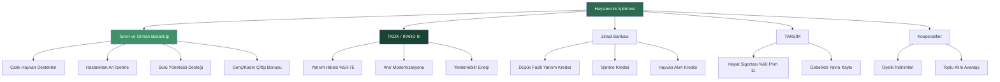

# Devlet Destekleri Rehberi | Government Support & Incentives Guide
## Türkiye Hayvancılık Ekosisteminde Finansal Destek Haritası

> **TR:** Bu kılavuz, hayvancılık sektörüne giren ya da mevcut işletmesini büyütmek isteyen profesyoneller için Türkiye'deki tüm devlet desteklerini, hibe programlarını, sübvansiyonlu kredileri ve sigorta avantajlarını tek çatı altında toplamaktadır.
>
> **EN:** This guide consolidates all Turkish government grants, subsidized credits, and insurance incentives for livestock professionals under one roof.

---

## 📊 Destek Ekosistemi Haritası | Support Ecosystem Map



---

## 1. 🏛️ Tarım ve Orman Bakanlığı Destekleri

### 1.1 Katsayı Sistemi Nedir?

2024-2026 döneminde Bakanlık, "sabit tutar" yerine **katsayı bazlı** bir ödeme sistemi uygulamaktadır. Formül şudur:

```
Net Ödeme = Temel Tutar × [1 + Σ (Geçerli Katsayılar)]
```

Bu sistem, aynı hayvan için farklı çiftçilerin farklı miktarda destek almasına imkân tanır. Tüm katsayıları aynı anda kullanmak → **maksimum getiri** demektir.

### 1.2 Temel Destekler (2025 Güncel)

| Destek Kalemi | Temel Tutar | 2024'e Göre Artış |
|---|---|---|
| **Buzağı Desteği** | 1.400 TL/baş | +%40 |
| **Malak Desteği** | 2.800 TL/baş | +%180 |
| **Kuzu/Oğlak Desteği** | 300 TL/baş | +%50 |
| **Dişi Buzağı (Ari İşletme)** | 3.500 TL/baş* | - |

*Hastalıktan ari statüdeki işletmelerde dişi buzağı desteği temel tutarın 2-3 katına çıkabilmektedir.

### 1.3 İlave Katsayılar

| Katsayı | Gereklilik | Ek Oran |
|---|---|---|
| **Genç Çiftçi** | 40 yaş altı | +%25 |
| **Kadın Çiftçi** | Kayıtlı kadın işletmeci | +%25 |
| **1. Derece Örgüt Üyeliği** | Kooperatif/Birlik aktif üyelik | +%10 |
| **Planlı Üretim Bölgesi** | Bakanlık'ın belirlediği bölge/ürün | +%15 |
| **Organik Sertifika** | Akredite organik belge | +%50 |
| **Hastalıktan Ari İşletme** | Resmi ari statüsü (B1/B2) | +%30-100 |

> **Hesaplama Örneği:** Genç, kadın, kooperatif üyesi, ari işletmede buzağı desteği:
> `1.400 × (1 + 0.25 + 0.25 + 0.10 + 0.30) = 1.400 × 1.90 = 2.660 TL/buzağı`

### 1.4 Sürü Yöneticisi Desteği

- **Kimler yararlanır?** 150 baş ve üzeri küçükbaş (kuzu/oğlak) varlığına sahip işletmeler.
- **Ne verilir?** Sürüde çalışan lisanslı sürü yöneticisinin maaşının bir kısmı Bakanlık tarafından karşılanır.
- **Faydası:** Büyük koyun işletmelerinde işgücü maliyetini düşüren kritik bir destek.

### 1.5 Önemli Önkoşullar

> [!IMPORTANT]
> Bakanlık desteklerinden yararlanabilmek için **tüm** aşağıdaki kayıtların eksiksiz ve güncel olması zorunludur:
> - **TÜRKVET** (Türkiye Veteriner Bilgi Sistemi) — Her hayvanın küpe numarasıyla kayıtlı olması
> - **ÇKS** (Çiftçi Kayıt Sistemi) — İşletmenin arazi/faaliyet kaydı
> - **İşletme Tescil Belgesi** — İl Tarım Müdürlüğü onaylı
> - **Hastalıktan Ari İşletme Statüsü** (ek destek için)

---

## 2. 🇪🇺 TKDK / IPARD III — AB Destekli Yatırım Hibesi

### 2.1 Programa Genel Bakış

**TKDK (Tarım ve Kırsal Kalkınmayı Destekleme Kurumu)**, Avrupa Birliği ve Türkiye Cumhuriyeti ortak finansmanıyla yürütülen **IPARD III Programı**'nı uygular. Bu program, hayvancılık sektöründeki en büyük **geri ödemesiz hibe** kaynağıdır.

- **Hibe Oranı:** Uygun yatırım tutarının **%50 - %75'i** geri ödemesiz karşılanır.
- **Kapsama:** Türkiye'nin 81 ili (il bazında öncelik listesi değişkendir).
- **Çağrı Periyodu:** Yılda 1-2 kez başvuru dönemi açılır; takip etmek şarttır.

### 2.2 Desteklenen Yatırım Kalemleri

| Yatırım Konusu | Açıklama | Hibe Oranı |
|---|---|---|
| **Süt Sığırı Ahırı** | Yeni veya modernizasyon | %50 |
| **Sağım Ekipmanı** | Milking parlor, VMS robot | %50 |
| **Soğutma Tankı** | Süt depolama ve soğutma | %50 |
| **TMR Mikseri** | Yem hazırlama ekipmanı | %50 |
| **Biyogaz Tesisi** | Gübre + enerji | %65 |
| **Güneş Enerjisi (PV)** | Çiftlik elektriği | %65-75 |
| **Depo ve Silaj Tesisi** | Yem deposu, silaj çukuru | %50 |
| **Young Farmer (Genç)** | 40 yaş altı başvuru sahibi | +%10 ek |

### 2.3 Başvuru Adımları (Adım Adım)

```
ADIM 1: Fizibilite Raporu Hazırla
         → Yatırım tutarını ve geri ödeme planını belgele
         
ADIM 2: TKDK İl Koordinatörlüğü'ne Ön Görüşme
         → Başvuru kriterlerini sorgula
         
ADIM 3: Çağrı Dönemini Takip Et
         → tkdk.gov.tr → Duyurular
         
ADIM 4: Başvuru Portalına Kayıt
         → e-Başvuru sistemi üzerinden online başvuru

ADIM 5: Proje Değerlendirme Süreci
         → Teknik inceleme: 3-6 ay

ADIM 6: Taahhütname ve Sözleşme İmzalama
         → Yatırıma başlama izni

ADIM 7: Yatırımı Gerçekleştir & Ödeme Talep Et
         → Fatura ve hakediş belgelerini sun
```

### 2.4 Dikkat Edilmesi Gereken Riskler

> [!WARNING]
> IPARD hibesinde en sık yapılan hatalar:
> - Çağrı açılmadan **yatırıma başlamak** → Hibe hakkı düşer.
> - İhale usulüne aykırı tedarikçi seçimi → Ödeme iptali.
> - **Taahhüt süresi (5 yıl)** dolmadan yatırımı satmak/devretmek → Geri ödeme + ceza.
> - Raporlama dönemlerini kaçırmak → Sözleşme feshi.

---

## 3. 🏦 Ziraat Bankası & Tarımsal Finansman

### 3.1 Düşük Faizli Yatırım Kredileri

Cumhurbaşkanlığı Kararnamesi kapsamında, hayvancılık yatırımlarına yönelik **Hazine faiz sübvansiyonlu** krediler sağlanmaktadır.

| Kredi Türü | Kullanım Amacı | Faiz İndirimi |
|---|---|---|
| **Yatırım Kredisi** | Ahır, ekipman, damızlık hayvan | %25-100 (kritere göre) |
| **İşletme Kredisi** | Yem, ilaç, veteriner | %25-75 |
| **Hayvan Alım Kredisi** | Damızlık inek, koç, teke | %50 |

### 3.2 Kimler Daha Fazla İndirim Alır?

| Özellik | Ek Faiz İndirimi |
|---|---|
| Genç Çiftçi (≤40 yaş) | +%25 |
| Kadın Girişimci | +%25 |
| Kooperatif Üyesi | +%10 |
| OSB/OTB'de Yatırım | +%15 |
| Küçükbaş Hayvancılık | +%20 |
| Stratejik Ürün Üretimi | +%30 |

### 3.3 Özel Kredi Projeleri

**"Köyümde Yaşamak İçin Bir Sürü Nedenim Var"**
- Küçükbaş (koyun/keçi) işletmesi kurmak isteyenlere yönelik.
- 7 yıla kadar vade, 2 yıl geri ödemesiz dönem.
- Faiz oranı: %0-5 bandı (dönemsel güncelleme).

**"Kırsalda Bereket"**
- Kırsal bölgelerde bütünleşik çiftlik kurulumunu destekler.
- Kombine (ahır + sera + depo) yatırımlarda ek indirim.

### 3.4 Başvuru İçin Hazır Olmanız Gereken Belgeler

```
Temel Belgeler:
✓ ÇKS ve/veya TÜRKVET belgesi
✓ Tapu veya kira sözleşmesi (≥ 10 yıl)
✓ Vergi levhası
✓ İşletme tescil belgesi

Yatırım Belgesi:
✓ Teknik proje (ahır vaziyet planı, ekipman listesi)
✓ Fizibilite özeti (3 yıllık gelir-gider tahmini)
✓ Fiyat teklifleri (min 3 tedarikçi)

Varsa Bonus Belgeler:
✓ Genç Çiftçi belgesi (TKDK onaylı)
✓ Kooperatif üyesi belgesi
✓ Organik tarım sertifikası
```

---

## 4. 🛡️ TARSİM — Devlet Destekli Tarım Sigortası

### 4.1 2025-2026 Yenilikleri

| Değişiklik | Detay |
|---|---|
| **Prim Desteği Artışı** | %50 → **%60** (büyükbaş hayat sigortası) |
| **Yeni Teminat** | 20 ay+ dişi sığırlara "Gebelikte Yavru Kaybı" |
| **Üyelik İndirimi** | 1. derece tarımsal örgüt üyelerine **%5 prim indirimi** |
| **Planlı Üretim İndirimi** | Bakanlık planlı üretim kapsamındaki ürünlerde **prim indirimi** |

### 4.2 Sigorta Kapsamları

| Sigorta Tipi | Teminatlar | Prim Desteği |
|---|---|---|
| **Hayat Sigortası** | Ölüm, mecburi kesim | %60 |
| **Verim Sigortası** | Süt verimi düşüşü (iklim kaynaklı) | %50 |
| **Ahır Yangın/Doğal Afet** | Yapı hasarı | %50 |
| **Hayvan Sürüsü Afet** | Dolu, fırtına, deprem | %60 |

### 4.3 Neden Zorunlu Gibi Düşünün?

> Bir Holstein inek değeri: ~80,000-100,000 TL
> Yıllık sigorta primi: ~2,000-3,500 TL
> Devlet prim desteği (%60): ~1,200-2,100 TL
>
> **Size kalacak net prim: ~800-1,400 TL/baş/yıl**
>
> 50 başlık sürü → Potansiyel koruma: 4-5 milyon TL | Net maliyet: ~50,000 TL/yıl

---

## 5. 🤝 Kooperatifler & Tarımsal Örgütlenme

### 5.1 Neden Kooperatif Üyesi Olmalısınız?

Kooperatif üyeliği, salt "dayanışma" değil, **somut finansal avantajdır**:

| Avantaj | Değeri |
|---|---|
| Bakanlık desteğinde ek katsayı | +%10 katsayı = Net gelir artışı |
| TARSİM prim indirimi | %5 yıllık prim tasarrufu |
| Ziraat Bankası faiz indirimi | +%10 ek sübvansiyon |
| Toplu yem alımı | %8-15 maliyet avantajı |
| Ortak sperma/aşı alımı | %20-30 maliyet avantajı |
| Kesimhane ortaklığı | Et değer zincirine direkt erişim |

### 5.2 Temel Örgütlenme Türleri

| Örgüt | Açıklama | Bağlantı |
|---|---|---|
| **Tarım Kredi Kooperatifi** | Finansman ve girdi tedariki | [tarimkredi.com.tr](https://www.tarimkredi.com.tr) |
| **Süt Üreticileri Birliği** | Süt pazarlama, ortak müzakere | İl bazlı |
| **Yetiştiriciler Birliği** | Soy kütüğü ve ıslah programları | [hayvanciliklastik.org.tr](http://www.hayvanciliklastik.org.tr) |
| **Damızlık Sığır Yetiştiricileri** | DSYMB — Holstein soy kütüğü | il bazlı |

---

## 6. 🧮 Hibe Optimizasyon Hesaplayıcısı | Incentive Calculator

```python
# Hızlı Hesaplama: Hangi Desteklere Hak Kazandınız?

def calculate_support(
    herd_size: int,
    animal_type: str,   # "buyukbas" veya "kucukbas"
    is_young: bool,     # 40 yaş altı
    is_female: bool,    # Kadın işletmeci
    is_cooperative: bool,  # Kooperatif üyesi
    is_ari: bool,       # Hastalıktan ari işletme
    is_planned: bool,   # Planlı üretim bölgesi
    is_organic: bool    # Organik sertifikalı
) -> dict:

    # Temel tutarlar (2025)
    base = {"buyukbas": 1400, "kucukbas": 300}[animal_type]

    # Katsayı hesabı
    multiplier = 1.0
    if is_young:      multiplier += 0.25
    if is_female:     multiplier += 0.25
    if is_cooperative: multiplier += 0.10
    if is_planned:    multiplier += 0.15
    if is_organic:    multiplier += 0.50
    if is_ari:        multiplier += 0.30

    per_head = base * multiplier
    annual_total = per_head * herd_size

    return {
        "per_head_tl":      round(per_head, 0),
        "annual_total_tl":  round(annual_total, 0),
        "multiplier":       round(multiplier, 2),
        "bonus_pct":        round((multiplier - 1.0) * 100, 1)
    }

# Örnek: 50 baş, genç, kadın, kooperatif, ari işletme
result = calculate_support(50, "buyukbas", True, True, True, True, False, False)
# -> {'per_head_tl': 2520.0, 'annual_total_tl': 126000.0, 'multiplier': 1.8, 'bonus_pct': 80.0}
```

---

## 7. 📋 Başvuru Zaman Çizelgesi | Application Timeline

```mermaid
gantt
    title Hayvancılık Destekleri Başvuru Takvimi (Tipik Yıl)
    dateFormat  MM
    axisFormat  %B

    section Bakanlık Destekleri
    Hayvan Sayım Bildirimleri     :01, 2M
    Destek Başvuruları            :03, 3M
    Ödeme Dönemi                  :08, 4M

    section TKDK / IPARD
    Çağrı Duyurusu (1. Dönem)    :01, 2M
    Başvuru Penceresi             :02, 2M
    Değerlendirme Süreci          :04, 4M
    Sözleşme İmzalama             :08, 2M
    Çağrı Duyurusu (2. Dönem)    :09, 2M

    section TARSİM
    Poliçe Yenileme / Yeni Başvuru :01, 12M
```



---

## 8. 🔗 Resmi Kaynaklar & Linkler

| Kurum | Açıklama | URL |
|---|---|---|
| **Tarım ve Orman Bakanlığı** | Destekler Tebliği, ÇKS, TÜRKVET | [tarimorman.gov.tr](https://www.tarimorman.gov.tr) |
| **TKDK** | IPARD III Çağrıları ve Başvuru | [tkdk.gov.tr](https://www.tkdk.gov.tr) |
| **Ziraat Bankası** | Tarımsal Kredi Ürünleri | [ziraatbank.com.tr](https://www.ziraatbank.com.tr) |
| **TARSİM** | Tarım Sigortası | [tarsim.gov.tr](https://www.tarsim.gov.tr) |
| **Tarım Kredi** | Kooperatif Hizmetleri | [tarimkredi.com.tr](https://www.tarimkredi.com.tr) |
| **e-Devlet Hayvancılık** | TÜRKVET Kayıt Sorgulama | [turkvet.gov.tr](https://www.turkvet.gov.tr) |

---

> **Son Güncelleme:** Nisan 2026
> **Uyarı:** Destek tutarları her yıl Cumhurbaşkanlığı Kararnameleri ve Bakanlık Tebliğleri ile güncellenmektedir. Kesin bilgi için ilgili kurumların resmi sitelerini takip ediniz.
